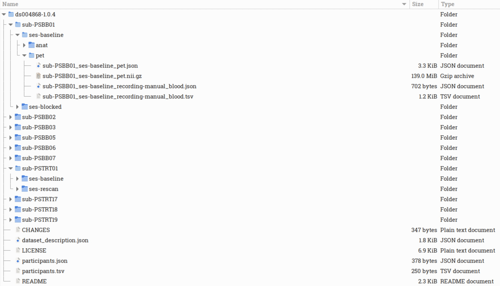
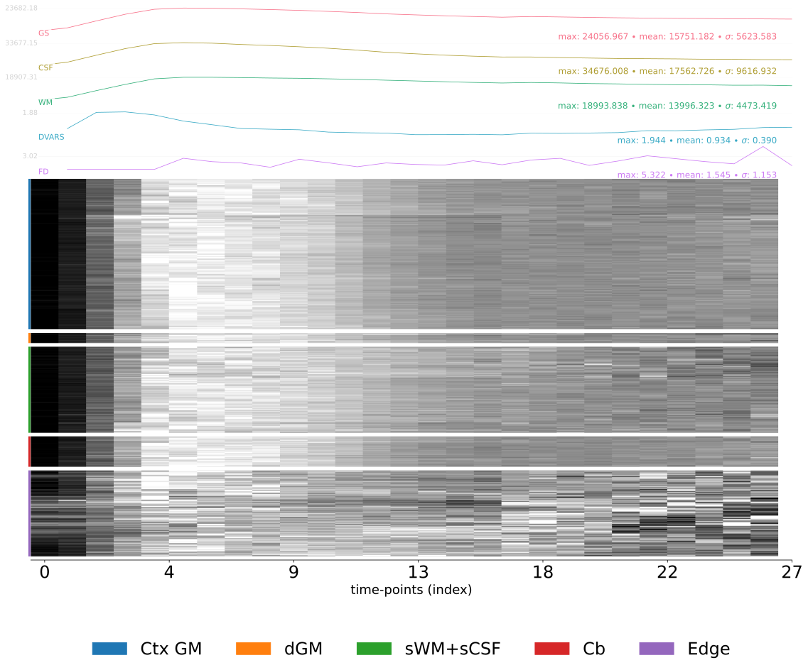
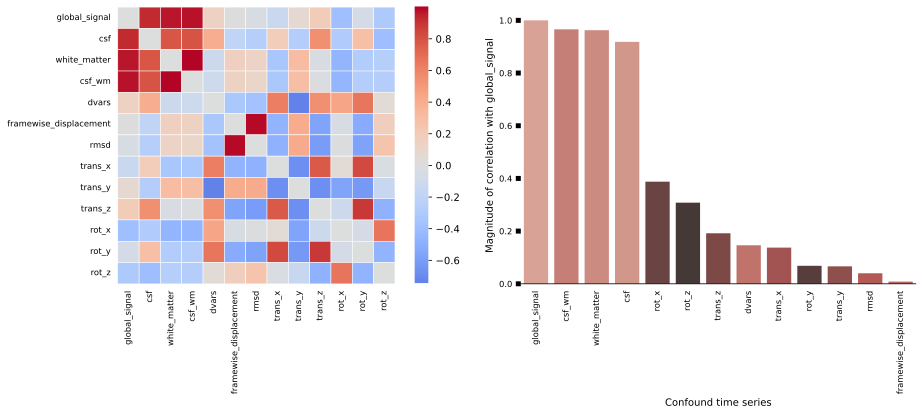

# PETPrep Tutorial

This tutorial will guide you through running **PETPrep** on a real dataset from [OpenNeuro dataset: ds004868](https://openneuro.org/datasets/ds004868/versions/1.0.4).
This dataset is already **BIDS-valid**, the main prerequisite of running PETPrep.

We’ll cover:

1. Installing PETPrep
2. Downloading data from OpenNeuro
3. Running PETPrep commands
4. Inspecting outputs and reports

---

## 1. Install PETPrep

PETPrep is distributed as a **BIDS App container**. You can run it via **Docker** (preferred for local machines) or **Apptainer** (common on HPC systems where Docker is not allowed).

### Install **Docker** / **Apptainer**

* For **Docker**, follow the instructions here: [Docker Desktop installation guide](https://docs.docker.com/get-docker/).
* For **Apptainer** (previously Singularity), follow the instructions here: [Apptainer installation guide](https://apptainer.org/docs/admin/main/installation.html).

To check if Docker or Apptainer is installed, run:

```
docker --version
apptainer --version
```

### Pull the PETPrep image

**Docker:**

```
docker pull ghcr.io/nipreps/petprep:latest
```

**Apptainer:**

```
apptainer pull petprep-latest.sif docker://ghcr.io/nipreps/petprep:latest
```

More details: [PETPrep Installation Docs](https://petprep.readthedocs.io/en/latest/installation.html#containerized-execution-docker-and-apptainer)

---

## 2. Download data from OpenNeuro

We will use dataset **[ds004868 v1.0.4](https://openneuro.org/datasets/ds004868/versions/1.0.4)**.

### Option A: Command line (recommended)

Install the OpenNeuro client (requires Node.js):

```
npm install -g openneuro-cli
```

Download the dataset:

```
openneuro download --dataset ds004868 --snapshot 1.0.4 /bidsdata
```

For more info: [OpenNeuro CLI Documentation](https://docs.openneuro.org/packages/openneuro-cli.html)

### Option B: Web download

1. Go to the dataset page: [ds004868 v1.0.4](https://openneuro.org/datasets/ds004868/versions/1.0.4)
2. Click **Download dataset**
3. Extract the archive into `/bidsdata`

### Verify your data

```
ls /bidsdata
```

Expected files:



Note that this dataset is not entirely bids valid, as the CHANGES and LICENSE should not be in the root. Move them elsewhere before running PETprep.

---

## 3. Running PETPrep commands

PETPrep follows the standard BIDS App command pattern:

```
<app> <bids_dir> <outputs_dir> <analysis_level> [OPTIONS]
```

### **Docker** example (single subject)

```
docker run -it --rm \
  -v /bidsdata:/data:ro \
  -v /outputs:/out \
  -v /scratch:/work \
  -v /license.txt:/license.txt:ro \
  ghcr.io/nipreps/petprep:latest \
  /data /out participant \
  --participant-label sub-01 \
  --fs-license-file /license.txt \
  --work-dir /work
```

### **Apptainer** example (single subject)

```
apptainer run \
  -B /bidsdata:/data:ro \
  -B /outputs:/out \
  -B /scratch:/work \
  -B /license.txt:/license.txt:ro \
  petprep-latest.sif \
  /data /out participant \
  --participant-label sub-01 \
  --fs-license-file /license.txt \
  --work-dir /work
```

---

## 4. Inspecting outputs and reports

After the run finishes, check the output directory (e.g., `/outputs`):


* The **HTML report** (`report.html`) can be opened in a web browser.
* QC figures (e.g., coregistration, motion plots) are inside the `figures/` folder.
* Preprocessed PET images and transformations are in the `petprep/` folder.


After each run, PETPrep generates an interactive **HTML report**. This file summarizes both anatomical and PET preprocessing, and provides QC figures. Opening the report in your browser is usually the easiest way to check data quality.

### Summary section
The top of the report lists:
- **Subject ID** and sessions processed
- Structural images (e.g. T1-weighted scans)
- Functional/PET series and number of frames
- Output spaces (e.g. native T1w and MNI152 template)
- FreeSurfer reconstruction status

This gives you a quick overview of what PETPrep detected and processed.

---

### Anatomical QC

- **T1-weighted segmentation**  
    
  Shows the brain mask and tissue segmentation (GM, WM, CSF). Check that boundaries look plausible.

- **Spatial normalization**  
    
  Displays alignment of the T1w image to the MNI template. Check for good overlap. Note: On GitHib this figure looks static, but if you open it locally on your browser, it will toggle between subject and template. 


- **FreeSurfer surfaces**  
    
  Shows white/pial surfaces reconstructed with FreeSurfer. Misplacements can indicate surface errors.

---

### PET QC

- **Carpet plot**  
    
  Frame-by-frame tracer uptake across voxels. Disruptions or spikes may indicate motion.

- **Confound correlation**  
    
  Correlation matrix of motion and global signals. High correlations may suggest motion or physiological artifacts.

- **PET to MRI co-registration**  
    
  Shows alignment between the PET reference and T1w MRI. Misalignments here affect all downstream analyses.

- **Reference mask check**  
    
  Displays the cerebellar reference mask used for quantification. Ensure it fits within the cerebellum and avoids spillover.

---

