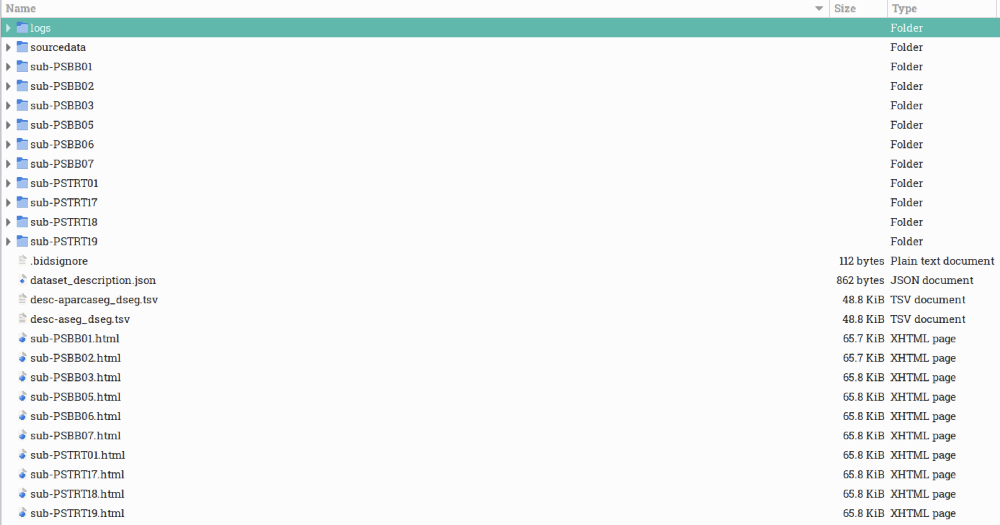
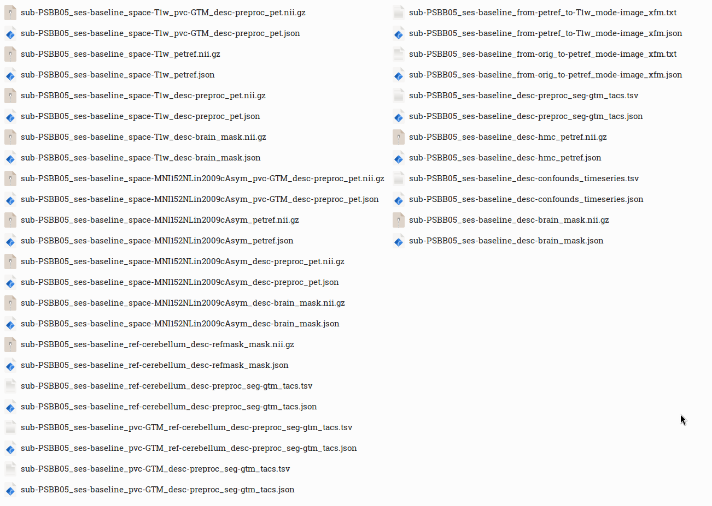
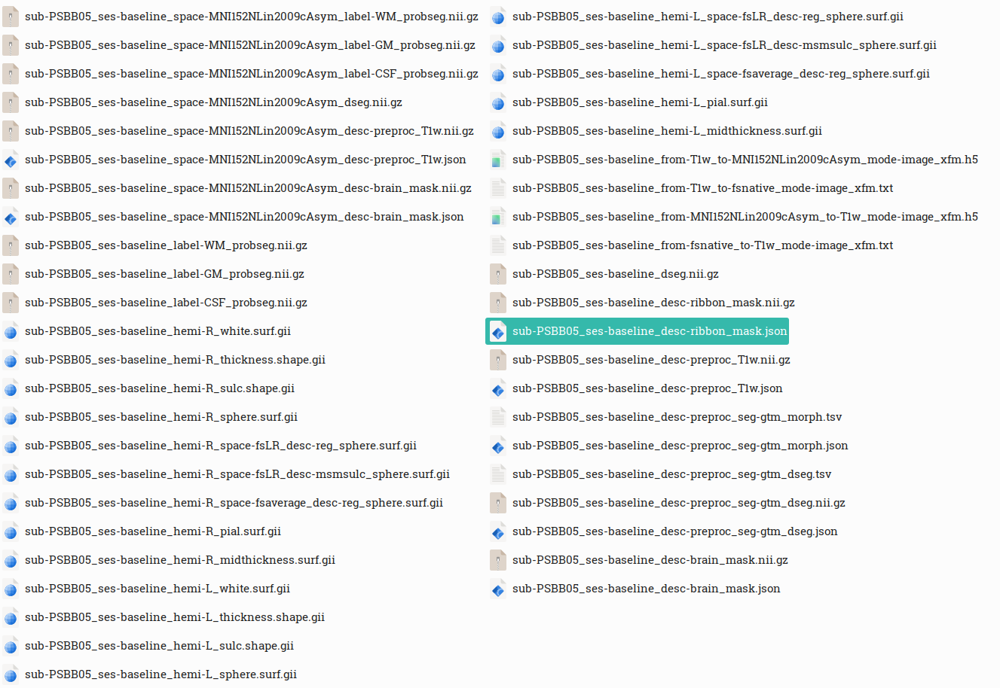
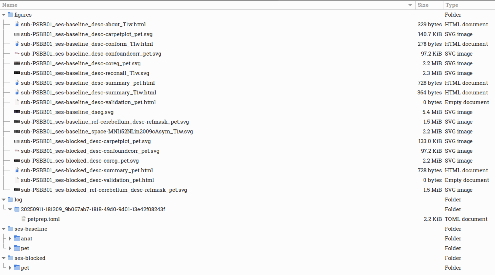
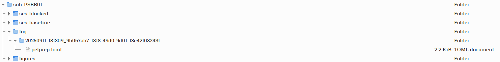

# PETPrep Tutorial

This tutorial will guide you through running **PETPrep** on a real dataset from [OpenNeuro dataset: ds004868](https://openneuro.org/datasets/ds004868/versions/1.0.4).
This dataset is already **BIDS-valid**, the main prerequisite of running PETPrep.

We’ll cover:

1. Installing PETPrep
2. Downloading data from OpenNeuro
3. Running PETPrep commands
4. Inspecting html quality control reportd
5. Understanding PETPrep output files

---

## 1. Install PETPrep

PETPrep is distributed as a **BIDS App container**. You can run it via **Docker** (preferred for local machines) or **Apptainer** (common on HPC systems where Docker is not allowed).

### Install **Docker** / **Apptainer**

* For **Docker**, follow the instructions here: [Docker Desktop installation guide](https://docs.docker.com/get-docker/).
* For **Apptainer** (previously Singularity), follow the instructions here: [Apptainer installation guide](https://apptainer.org/docs/admin/main/installation.html).

To check if Docker or Apptainer is installed, run:

```
docker --version
apptainer --version
```

### Pull the PETPrep image

**Docker:**

```
docker pull ghcr.io/nipreps/petprep:latest
```

**Apptainer:**

```
apptainer pull petprep-latest.sif docker://ghcr.io/nipreps/petprep:latest
```

More details: [PETPrep Installation Docs](https://petprep.readthedocs.io/en/latest/installation.html#containerized-execution-docker-and-apptainer)

---

## 2. Download data from OpenNeuro

We will use dataset **[ds004868 v1.0.4](https://openneuro.org/datasets/ds004868/versions/1.0.4)**.

### Option A: Command line

Install the OpenNeuro client (requires Node.js):

```
npm install -g openneuro-cli
```

Download the dataset:

```
openneuro download --dataset ds004868 --snapshot 1.0.4 /bidsdata
```

For more info: [OpenNeuro CLI Documentation](https://docs.openneuro.org/packages/openneuro-cli.html)

### Option B: Web download

1. Go to the dataset page: [ds004868 v1.0.4](https://openneuro.org/datasets/ds004868/versions/1.0.4)
2. Click **Download dataset**
3. Extract the archive into `/bidsdata`

### Verify your data

```
ls /bidsdata
```

Expected files:


Note that this dataset is not entirely bids valid, as the CHANGES and LICENSE should not be in the root. Move them elsewhere before running PETprep.

---

## 3. Running PETPrep commands

PETPrep follows the standard BIDS App command pattern:

```
<app> <bids_dir> <outputs_dir> <analysis_level> [OPTIONS]
```

### **Docker** example (single subject)

```
docker run -it --rm \
  -v /bidsdata:/data:ro \
  -v /outputs:/out \
  -v /scratch:/work \
  -v /license.txt:/license.txt:ro \
  ghcr.io/nipreps/petprep:latest \
  /data /out participant \
  --participant-label sub-01 \
  --fs-license-file /license.txt \
  --work-dir /work
```

### **Apptainer** example (single subject)

```
apptainer run \
  -B /bidsdata:/data:ro \
  -B /outputs:/out \
  -B /scratch:/work \
  -B /license.txt:/license.txt:ro \
  petprep-latest.sif \
  /data /out participant \
  --participant-label sub-01 \
  --fs-license-file /license.txt \
  --work-dir /work
```

### in this example, we called the whole folder via apptainer as follows:

```
apptainer run \
  --bind /petprep/tutorial_out/ds004868-1.0.4_derivatives:/out \
  --bind /petprep/tutorial_data/ds004868-1.0.4/:/data:ro \
  --bind /petprep/freesurfer_license/license.txt:/license \
  --bind /petprep/tutorial_work/:/work \
/petprep/code/petprep-latest.sif /data /out participant \
  --fs-license-file /license \
  --work-dir /work \
  --ref-mask-name cerebellum \
  --nprocs 20
```

- `--ref-mask-name cerebellum` uses cerebellum as reference tissue for normalization. Choose the reference region depending on the type of tracer used in the dataset.
- `--nprocs 20` runs 20 tasks in parallel on 20 individual physical cores. Note that too high parallel processes can overload system if cores or storage are not available.


## 4. Inspecting outputs and reports

After the run finishes, check the output directory (e.g., `/outputs`):
* The **HTML report** (`report.html`) can be opened in a web browser.
* QC figures (e.g., coregistration, motion plots) are inside the `figures/` folder.
* Preprocessed PET images and transformations are in the `petprep/` folder.


After each run, PETPrep generates an **HTML report**. This file summarizes both anatomical and PET preprocessing, and provides QC figures. Opening the report in your browser is usually the easiest way to check data quality.

### Summary section
The top of the report lists:
- **Subject ID** and sessions processed
- Structural images (e.g. T1-weighted scans)
- Functional/PET series and number of frames
- Output spaces (e.g. native T1w and MNI152 template)
- FreeSurfer reconstruction status

This gives you a quick overview of what PETPrep detected and processed.

---

### Anatomical QC

- **Brain mask and brain tissue segmentation of the T1w**  
    
  Shows the brain mask and tissue segmentation (GM, WM, CSF). Check that boundaries look plausible.

- **Spatial normalization of the anatomical T1w reference**  
    
  Displays alignment of the T1w image to the MNI template. Check for good overlap. Note: On GitHib this figure looks static, but if you open it locally on your browser, it will toggle between subject and template. 


- **Surface reconstruction**  
    
  Shows white/pial surfaces reconstructed with FreeSurfer on top of the participants T1w template. Misplacements can indicate surface errors.

---

### PET QC

- **Carpet plot**  
    
  PETprep implements consecutive frame motion correction, meaning that each frame is aligned to the one before it. This also means that there's no single reference frame for motion correction! Using the flag `--hmc-start-time`, which defaults to 120 sec, you can set the starting point for head motion correction.

How to read the first graph:
    - GS = Global Signal, The average time series across the whole brain mask. Used to check for scanner drifts, global artifacts, or physiological noise.
    - CSF = Cerebrospinal Fluid signal. Average signal extracted from CSF voxels. Often used as a nuisance regressor because CSF is dominated by noise rather than neuronal activity or tracer uptake.
    - WM = White Matter signal. Average signal from white matter voxels. Another typical nuisance regressor; helps identify noise contributions unrelated to gray matter metabolism or binding.
    - DVARS = D temporal VARiance of Signal. Measures how much the signal intensity changes frame-to-frame across the whole brain. Spikes indicate possible motion or sudden scanner artifacts.
    - FD = Framewise Displacement. A head-motion metric summarizing how much the subject’s head moved between frames (translations + rotations combined). High peaks → strong motion events.


How to read the second graph:
If the carpet plot shows smooth shading transitions across frames, that indicates motion was minimal and tracer uptake is stable. In contrast, sudden vertical bands or shifts are a clear sign of motion artifacts. Uneven brightness across different tissue classes reflects tracer-specific uptake dynamics.
    - Ctx GM (blue) = cortical gray matter
    - dGM (orange) = deep gray matter (e.g., thalamus, basal ganglia)
    - sWM + sCSF (green) = surrounding white matter + subcortical CSF
    - Cb (red) = cerebellum
    - Edge (purple) = voxels at the brain boundary (where partial volume or motion artifacts are more common)

- **Confound correlation**  
    


Motion confounds:
  These include translations (x, y, z), rotations (x, y, z), and composite metrics like FD (framewise displacement) or RMSD. They capture head movements: the subject shifts, nods, or rotates. If motion regressors (FD, rotations, translations) had been highly correlated with global signal, that would indicate global signal is contaminated by head motion.

Physiological confounds:
  These include global signal, CSF, and white matter time series. They capture fluctuations caused by respiration and cardiac pulsation (blood flow changes), scanner drift, systemic metabolism changes (especially important in PET where uptake evolves with time).

By ranking correlations with global signal in graph 2, you can see whether motion or physiology is the main driver of motion. Weak motion–global signal correlation suggests motion correction worked well! Note that shading in the right plot lets you distinguish whether a confound increases with global signal (positive correlation) or moves in the opposite direction (negative correlation), the bar heights all represent absolute magnitudes.


- **PET to MRI co-registration**  
    
  Shows alignment between the PET reference and T1w MRI. Note that this image is not static when opened in a browser.


- **Reference mask check**  
    
  Reference region mask overlaid on the PET reference and anatomical. Note that this image is not static when opened in a browser.

---

## 5. Understanding PETPrep output files

### Main Output Folder



The root level of your `derivatives/petprep/` directory includes:

* **Subject folders** – Each participant has a folder (e.g., `sub-PSBB01/`) containing one or more session folders (`ses-baseline/`, `ses-blocked/`).
* **HTML reports** – Files like `sub-PSBB01.html`, which provide visual QC summaries per subject.
* **`figures/` folder** – Stores static QC figures and summaries.
* **`log/` folder** – Contains runtime logs and configuration information, including the `petprep.toml` file.

### PET Subfolder



The PET subfolder (`sub-PSBB05/ses-baseline/pet/`) contains preprocessed PET data, confound files, reference masks, and transforms. From your screenshot, we can identify the following visible files:

* **Preprocessed PET Images:**

  * `*_space-T1w_desc-preproc_pet.nii.gz` and `.json` – Motion-corrected PET in subject T1w space.
  * `*_space-MNI152NLin2009cAsym_desc-preproc_pet.nii.gz` and `.json` – Normalized PET in MNI template space.
  * `*_space-T1w_pvc-GTM_desc-preproc_pet.nii.gz` – Partial Volume Corrected PET using GTM method.

* **Reference and Masks:**

  * `*_space-T1w_desc-brain_mask.nii.gz` and `.json` – Subject-specific brain mask.
  * `*_space-MNI152NLin2009cAsym_desc-brain_mask.nii.gz` and `.json` – Brain mask in MNI space.
  * `*_ref-cerebellum_desc-refmask_mask.nii.gz` and `.json` – Reference region mask used for SUVR calculations.

* **Confound and Regional Data:**

  * `*_desc-confounds_timeseries.tsv` and `.json` – Framewise motion, global signal, DVARS, and other regressors.
  * `*_desc-preproc_seg-gtm_tacs.tsv` and `.json` – Regional TACs derived from GTM segmentation.

* **Transforms:**

  * `*_from-orig_to-petref_mode-image_xfm.json/.txt` – Mapping from raw PET to reference PET.
  * `*_from-petref_to-T1w_mode-image_xfm.json/.txt` – Mapping from reference PET to subject anatomy.
  * `*_from-T1w_to-MNI152NLin2009cAsym_mode-image_xfm.json/.txt` – Mapping from subject to template space.

> Together, these files allow full traceability of preprocessing, motion correction, and spatial normalization steps.

### ANAT Subfolder



The `anat/` folder contains FreeSurfer- and ANTs-derived anatomical outputs that serve as structural references for PET preprocessing. From your screenshot, these files are visible:

* **Anatomical Images and Masks:**

  * `*_space-MNI152NLin2009cAsym_desc-preproc_T1w.nii.gz` and `.json` – Preprocessed T1-weighted image in MNI space.
  * `*_desc-brain_mask.nii.gz` and `.json` – Brain extraction mask in native and template space.
  * `*_desc-ribbon_mask.nii.gz` and `.json` – Cortical ribbon mask, identifying gray and white matter boundaries.

* **Probabilistic Tissue Maps:**

  * `*_label-WM_probseg.nii.gz`, `*_label-GM_probseg.nii.gz`, `*_label-CSF_probseg.nii.gz` – Tissue probability maps for white matter, gray matter, and CSF.

* **Surface Files:**

  * `*_hemi-L.surf.gii` and `*_hemi-R.surf.gii` – Left and right hemisphere surfaces.
  * `*_hemi-L_pial.surf.gii`, `*_hemi-R_pial.surf.gii` – Cortical pial surfaces.
  * `*_hemi-*_sphere.surf.gii`, `*_desc-reg_sphere.surf.gii` – Spherical registration surfaces.
  * `*_hemi-*_thickness.shape.gii`, `*_hemi-*_sulc.shape.gii` – Cortical thickness and sulcal depth.

* **Transforms:**

  * `*_from-T1w_to-MNI152NLin2009cAsym_mode-image_xfm.*` – T1w-to-template registration transform.
  * `*_from-fsnative_to-T1w_mode-image_xfm.*` – Mapping from FreeSurfer native to T1w space.

> These anatomical derivatives form the foundation for PET registration, PVC, and segmentation-based analyses.

### FIGURES Subfolder



This folder contains static QC and visualization outputs. Based on your screenshot, the visible files include:

* `*_desc-summary_pet.html` – Summary of PET preprocessing.
* `*_desc-validation_pet.html` – Validation report showing metadata integrity checks.
* `*_desc-carpetplot_pet.svg` – Time-series visualization across voxels.
* `*_desc-confoundcorr_pet.svg` – Correlation matrix of confounds.
* `*_desc-coreg_pet.svg` / `*_desc-reconall_T1w.svg` – PET↔T1w alignment QC.
* `*_ref-cerebellum_desc-refmask_pet.svg` – Reference mask visualization.
* `*_space-MNI152NLin2009cAsym_desc-preproc_pet.svg` – PET image shown in MNI space.

> The figures provide quick visual verification of registration accuracy, mask coverage, and confound patterns.

### LOG Subfolder and Configuration File



Inside each subject’s `log/` folder, PETprep stores a record of the runtime environment and configuration in `petprep.toml`. This file ensures reproducibility of the entire workflow.

Example values from your `petprep.toml`:

```toml
[environment]
cpu_count = 72
exec_env = "singularity"
free_mem = 261.0
nipype_version = "1.9.2"
templateflow_version = "24.2.2"
version = "0.0.1a1.dev108+g5cee6a7a2"
```

**Interpretation:** PETprep was executed in a Singularity container with 72 CPU cores and 261 GB of memory available. Nipype and TemplateFlow versions are logged for traceability.

```toml
[execution]
bids_dir = "/data"
output_dir = "/out"
fs_license_file = "/license"
participant_label = ["PSBB01", "PSBB02", ... , "PSTRT19"]
output_spaces = "MNI152NLin2009cAsym:res-native T1w"
```

**Interpretation:** This section defines dataset paths, FreeSurfer license location, subject list, and target output spaces. The `run_uuid` uniquely identifies this PETprep run.

```toml
[workflow]
run_reconall = true
seg = "gtm"
pvc_tool = "petpvc"
pvc_method = "GTM"
pvc_psf = [6.0]
ref_mask_name = "cerebellum"
```

**Interpretation:** Indicates that FreeSurfer recon-all was run, GTM-based PVC was applied using the PETPVC tool with a 6 mm PSF, and the cerebellum was used as reference region.

```toml
[nipype]
nprocs = 72
omp_nthreads = 8
plugin = "MultiProc"
```

**Interpretation:** PETprep used local multiprocessing with up to 72 processes and 8 threads per process. The workflow was executed in parallel for efficiency.

> Reading the `petprep.toml` gives a clear snapshot of *how* the analysis was run — including system resources, input/output locations, and key methodological choices.


  


---  

